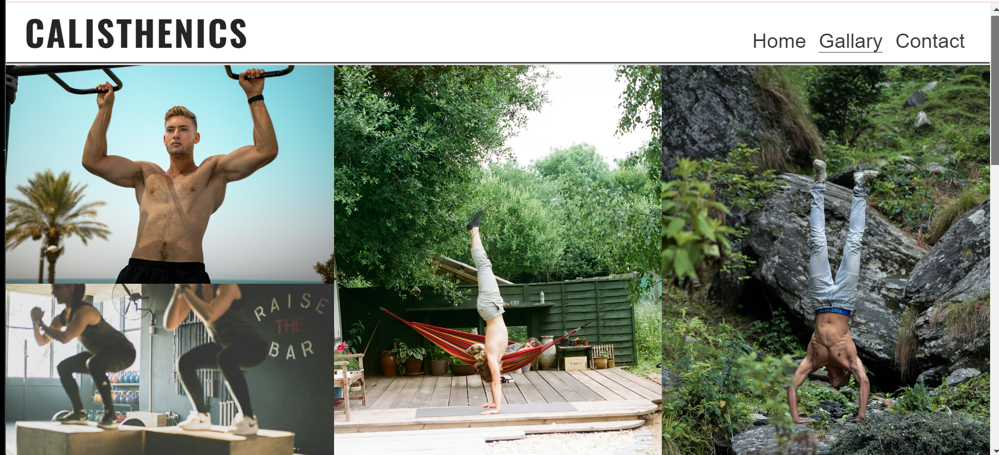

# Calisthenics
This website is intended for people with different backgrounds, young and old, men and women to bring their dream <strong>physiques</strong> into reality in Augsburg, Germany. It's main purpose is to bring people together to workout without having to pay for Fitness equipments and enjoy socialising with other group of people. Calsithenics workouts can be done in Parks, backyards and even in your own basement. No equipments are needed. 

## Existing Features
#### <li> Navigation Bar </li>
The website features three navigation Links with a orange hovering styled effect to the Logo, a Home page, a Gallery and a Contact page.  
Each navigation link  allows the visitor to browse effortlessly on the website and access all the pages without complications.   

#### <li> The landing page image </li>
The landing page features an indoor Calisthenics Gym image with a training bar and some gym equipments sorrounding it. Underneathe the landing page, gives you a **brief** explanation of what Caslisthenics is and why it's vital for you.

# The Footer
The footer section features all the social media sites of the website. Each link will direct you to your **prefered** social media site.  
The social mdeia sites allows you to stay intouch with some workout members, training tips and daily updates on the training schedules.    

# Gallery
The gallery section contains all the pictures from different workout members, training locations, athletes doing different training skills. It gives the user some clues on how Calisthenics exercises looks like and what to expect.

# Contact
In the contact section, the user will be asked to enter their fullname, email and mobile number. The ' write your message here..' section allows the user to send us any relevant comments and questions about Calisthenics workouts. After entering all your details, the user can press the send button (with an orange hovering effect) and we will get intouch as quickly as possible.

# Future ideas
<li>An event scheduling section</li>
<li>A sign up section</li>

# Testing
hgfgh
# Validator testing
<li>HTML</li>
ghhfd
<li>CSS</li>
fghff

# Deployment
The site was deployed to GitHub pages. The steps to deploy are as follows:
1. In the GitHub repository, navigate to the Settings tab
From the source section drop-down menu, select the Master Branch
Once the master branch has been selected, the page will be automatically refreshed with a detailed ribbon display to indicate the successful deployment.

# Credits
### Content
- The text on the home page was taking from wikipedia Article A
- The Favicon and the social media icons were taking from [Font-awesome](https://fontawesome.com)
- The styling of the Gallery images was taking from 

### Media
<li>The image used on the home page, on the contact background form and the images in the gallery section was taking from this open site source  https://unsplash.com/s/photos/street-workouts</li>
